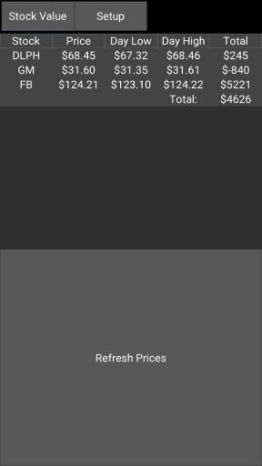

# Stock Watch
This is a simple Kivy application that tracks the latest price of a set of stocks and shows the amount you've gained or lost.   

## Platforms
It has been tested on Linux and Android.

##To Build:
In order to build for Android you must enable the CSV library.  Do this by editing each of the following files and removing the line containing _csv:
  1.  ./.buildozer/android/platform/python-for-android/src/blacklist.txt
  2.  ./.buildozer/android/platform/python-for-android/dist/stockwatch/blacklist.txt
